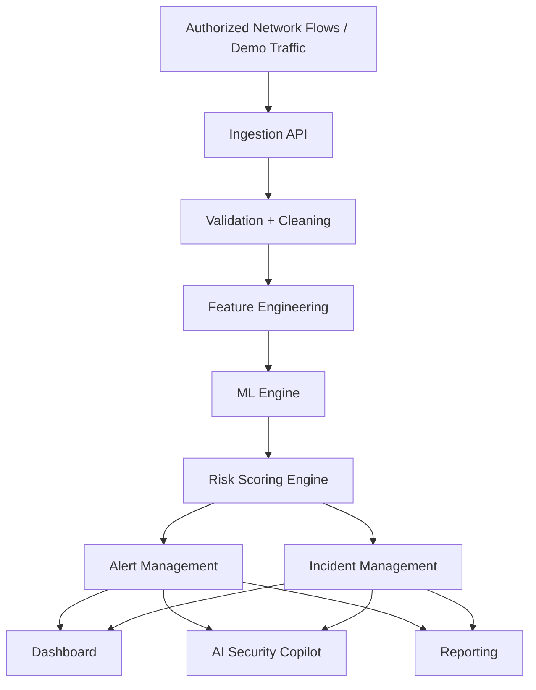

# AI-NTDRS System Design Overview

**Project:** AI Network Threat Detection & Response System (AI-NTDRS)  
**Purpose:** Convert the Phase 1 specification and Phase 2 research into an implementation-ready architecture.

---

## 1. Architecture Summary

AI-NTDRS uses a modular client-server architecture with a Python FastAPI backend, a React TypeScript frontend, a PostgreSQL database, and a separate ML pipeline for preprocessing, training, evaluation, and inference. The design prioritizes security, explainability, auditability, and ease of demonstration.

Core design principle:

**Network data → preprocessing → ML inference → risk scoring → alerting → investigation → safe response**

---

## 2. High-Level System Flow

---

## 3. Technology Stack

### Frontend
- React
- TypeScript
- Vite
- Tailwind CSS
- Recharts

### Backend
- Python
- FastAPI
- Pydantic
- SQLAlchemy or a comparable ORM

### Machine Learning
- pandas
- NumPy
- scikit-learn
- SHAP where feasible

### Database
- PostgreSQL

### Infrastructure
- Docker
- Docker Compose

### Testing
- Pytest
- API tests
- Frontend component tests where appropriate

---

## 4. Backend Module Boundaries

### 4.1 Authentication
Responsibilities:
- Login and logout.
- Password hashing.
- Session or token issuance.
- Role-based access control.
- Rate limiting on sensitive endpoints.
- Audit log events.

### 4.2 Devices
Responsibilities:
- Device inventory.
- Device profile and status.
- Risk history.
- Alert counts.
- Device detail and investigation views.

### 4.3 Network Flows
Responsibilities:
- Receive flow records.
- Validate and store records.
- Attach device metadata.
- Forward data to preprocessing and ML inference.

### 4.4 Detections and Predictions
Responsibilities:
- Store model predictions.
- Store anomaly scores or class labels.
- Persist explanation metadata.
- Link predictions to flows and devices.

### 4.5 Alerts
Responsibilities:
- Create and update alert records.
- Manage severity and lifecycle.
- Support filtering, search, and assignment.

### 4.6 Incidents
Responsibilities:
- Group related alerts.
- Track timelines, evidence, and analyst notes.
- Support response and resolution workflow.

### 4.7 Risk Engine
Responsibilities:
- Combine ML outputs with behavioral indicators.
- Produce transparent 0 to 100 scores.
- Map scores to LOW, MODERATE, HIGH, and CRITICAL.

### 4.8 Reports
Responsibilities:
- Generate incident reports.
- Support preview and export.
- Capture report generation audit events.

### 4.9 Audit Logs
Responsibilities:
- Record sensitive system actions.
- Preserve accountability.
- Support search and filtering.

### 4.10 AI Security Copilot
Responsibilities:
- Retrieve relevant records.
- Summarize facts, predictions, and recommendations.
- Prevent unsupported or dangerous actions.

---

## 5. Proposed API Grouping

### Authentication
- `POST /api/auth/login`
- `POST /api/auth/logout`
- `GET /api/auth/me`

### Dashboard
- `GET /api/dashboard/summary`
- `GET /api/dashboard/activity`
- `GET /api/dashboard/threats`

### Devices
- `GET /api/devices`
- `GET /api/devices/{id}`
- `GET /api/devices/{id}/timeline`
- `GET /api/devices/{id}/alerts`

### Flows
- `GET /api/flows`
- `POST /api/flows`

### Detections and Predictions
- `GET /api/predictions`
- `POST /api/predictions`
- `GET /api/detections`

### Alerts
- `GET /api/alerts`
- `GET /api/alerts/{id}`
- `PATCH /api/alerts/{id}`

### Incidents
- `GET /api/incidents`
- `POST /api/incidents`
- `GET /api/incidents/{id}`
- `PATCH /api/incidents/{id}`

### Reports
- `GET /api/reports`
- `POST /api/reports`
- `GET /api/reports/{id}`

### Audit Logs
- `GET /api/audit-logs`

### ML and Models
- `GET /api/models`
- `GET /api/models/{id}`
- `GET /api/models/{id}/metrics`

### Copilot
- `POST /api/copilot/query`

---

## 6. Database Design Summary

### Core Tables
- users
- roles
- user_roles
- devices
- network_flows
- model_versions
- model_predictions
- detections
- alerts
- incidents
- risk_scores
- response_actions
- reports
- audit_logs
- system_settings

### Important Design Notes
- Use surrogate primary keys or UUIDs.
- Add foreign keys for all relationships.
- Index on timestamps, device_id, alert severity, alert status, source_ip, destination_ip, and model_version.
- Store password hashes only.
- Keep audit logs append-only or strongly protected.
- Use timezone-aware timestamps.

### Relationship Principle
The database should allow traceability from a device to its flows, from a flow to a prediction, from a prediction to a detection, from a detection to an alert, and from an alert to an incident or response action.

---

## 7. ML Pipeline Architecture

### Training Path
1. Load dataset.
2. Validate schema.
3. Clean and deduplicate records.
4. Encode categorical values.
5. Scale or normalize numeric features when appropriate.
6. Train baseline anomaly and classification models.
7. Evaluate and compare metrics.
8. Save model artifacts and feature definitions.
9. Record model version metadata.

### Inference Path
1. Receive new flow record.
2. Validate and preprocess the record.
3. Generate features.
4. Run model prediction.
5. Compute risk score.
6. Create detection and alert if thresholds are exceeded.
7. Store explanation data for investigation.

### Model Choice Direction
- Isolation Forest for anomaly detection.
- Random Forest for classification baseline.
- Gradient Boosting as a comparison candidate.
- SHAP or feature importance for explanations.

---

## 8. Risk Scoring Design

The score should be transparent rather than arbitrary.

### Inputs
- Model anomaly score or class confidence.
- Failed connection rate.
- Port diversity.
- Traffic volume.
- Historical baseline deviation.
- Alert repetition.
- Device criticality where known.

### Output
- Numeric score from 0 to 100.
- Severity label mapped from configurable thresholds.

### Presentation
- Show the final score.
- Show contributing factors.
- Show the model signal separately from the final risk decision.

---

## 9. Security Architecture

### Access Control
- Role-based permissions.
- Protected routes and endpoints.
- Least privilege by default.

### Data Protection
- No plaintext passwords.
- Minimized collection of sensitive data.
- Secrets stored outside source control.
- Safe defaults for demo mode.

### Application Security
- Input validation.
- Parameterized queries or ORM usage.
- Rate limiting.
- Secure error handling.
- No stack traces in client responses.

### Response Safety
- Quarantine and disruptive controls are simulated unless explicitly authorized in a lab environment.
- Critical actions require confirmation and audit logging.

---

## 10. Frontend Information Architecture

### Primary Pages
- Login
- Dashboard
- Monitoring
- Devices
- Alerts
- Incidents
- Analytics
- AI Copilot
- Reports
- Audit Logs
- Settings

### Investigation Experience
- Device overview.
- Traffic history.
- Threat history.
- Risk timeline.
- Explanation panel.
- Analyst notes.

### UX Requirements
- Responsive layout.
- Accessible typography.
- Strong severity indicators.
- Search and filtering.
- Loading, empty, and error states.

---

## 11. Deployment Topology

### Development
- Local workstation or laptop.
- Docker Compose for backend, frontend, and database.
- Sample data for safe demonstrations.

### Demo
- Preloaded database fixtures.
- Simulated traffic generator.
- Safe response simulation.

### Future Pilot
- Authorized campus lab or controlled environment only.
- Network segmentation.
- Restricted accounts.
- Logged administrative actions.

---

## 12. Design Decisions to Validate Next

1. Final dataset choice.
2. Exact feature set for the first model.
3. Initial risk-score weighting.
4. Authentication mechanism preference: JWT or server sessions.
5. Whether model training is done inside the backend service or a separate ML service.
6. Final frontend route structure and component hierarchy.

---

## 13. Conclusion

This architecture is intentionally practical. It keeps the stack coherent, uses classical ML where it is strongest, and gives the dashboard a real SOC workflow instead of a generic admin layout. The next implementation step should be project scaffolding and backend foundation, but only after the dataset and feature pipeline are finalized.
