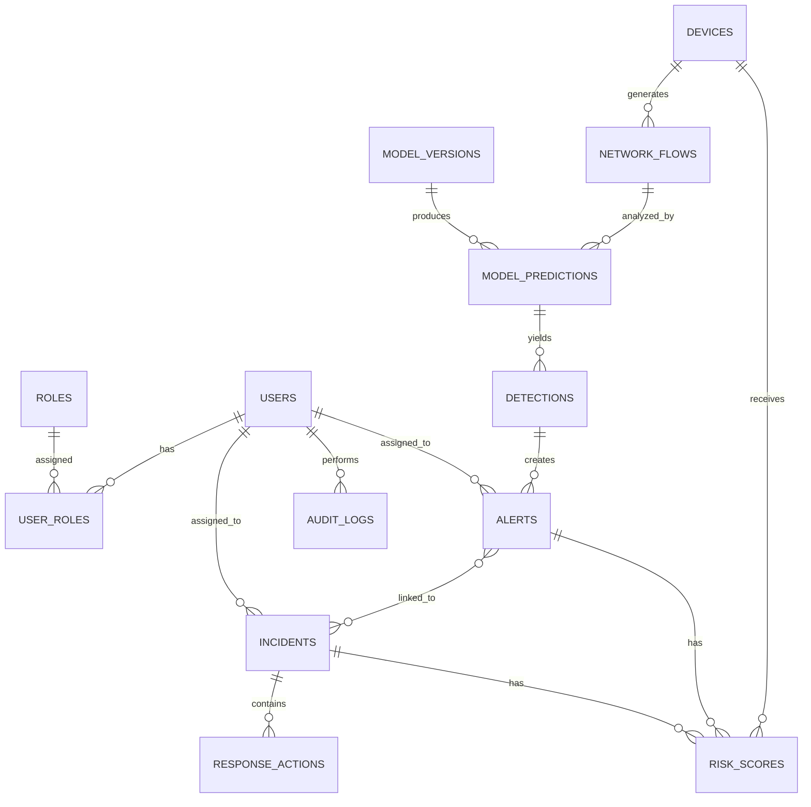

# AI Network Threat Detection & Response System (AI-NTDRS)
## Software Requirements and System Design Specification

**Project Title:** AI Network Threat Detection & Response System (AI-NTDRS)  
**Alternative Academic Title:** Design and Implementation of an AI-Based Network Intrusion Detection, Anomaly Monitoring, and Threat Response System for Educational Institutions  
**Document Status:** Phase 1 Deliverable - Requirements and System Design Specification  
**Implementation Status:** Not started by design. This document defines the system before coding begins.

---

## 1. Executive Summary

AI-NTDRS is a secure, explainable, and academically defensible cybersecurity platform for monitoring authorized educational networks. The system ingests network-flow or telemetry data, preprocesses and validates it, applies machine-learning models for anomaly detection and classification, computes a transparent risk score, and presents alerts and investigations in a modern SOC-style dashboard. It also includes controlled response recommendations, audit logging, and an AI Security Copilot that summarizes actual system data without inventing incidents.

The project is designed for a university or educational institution network where administrators have explicit authorization to monitor devices and traffic metadata. The system deliberately avoids packet payload inspection unless explicitly required and authorized, prioritizing privacy-preserving flow-based monitoring. The academic contribution is centered on whether machine learning can improve prioritization and interpretation of suspicious network behavior, not on replacing human judgment.

This specification defines the problem, scope, users, architecture, database design, ML pipeline, security model, dataset strategy, evaluation methodology, and deployment approach required before implementation.

---

## 2. Problem Statement

Educational institutions operate diverse networks that include student devices, staff laptops, servers, network appliances, mobile devices, and shared services. Traditional network monitoring tools can show traffic volume and basic alerts, but they often fail to explain why a device looks suspicious, how severe the risk is, and what action should be taken next. Security staff may face alert overload, fragmented visibility, and limited time to investigate large numbers of events.

The problem is to design a system that transforms raw network-flow data into actionable security intelligence. The system must detect suspicious patterns, prioritize events by risk, explain the reasons behind each prediction, and support safe response workflows that remain under human control.

---

## 3. Background

Network intrusion detection has traditionally relied on signature-based tools, rule engines, and manual review. These approaches are useful for known threats but can miss unusual behavior that does not match existing signatures. In educational environments, the network is typically heterogeneous, dynamic, and subject to both legitimate variation and misuse. As a result, a monitoring platform must distinguish ordinary changes in usage from patterns that indicate scanning, brute-force activity, denial-of-service-like traffic, or broader anomalies.

Machine learning offers a practical way to detect deviations from normal patterns and prioritize investigation. However, ML in security must be used carefully. Predictions are probabilistic signals, not proof of an attack. For this reason, the system must combine detection with explainability, risk scoring, auditability, and human review.

---

## 4. Motivation

The project is motivated by four practical needs:

1. Educational institutions need affordable, understandable, and maintainable security monitoring.
2. Security teams need a tool that prioritizes alerts rather than simply generating more of them.
3. Administrators need explanations they can defend in an academic or operational setting.
4. Students need a final-year project that demonstrates real systems engineering across networking, databases, machine learning, APIs, and UI design.

The platform should show how AI can assist, not replace, the human decision-maker.

---

## 5. Aim

To design and build a secure AI-based network threat detection and response system that monitors authorized network metadata, detects anomalous or suspicious behavior, explains why events are flagged, computes transparent risk scores, and supports safe incident handling through a professional SOC-style interface.

---

## 6. Specific Objectives

1. Define a secure and privacy-preserving network monitoring model for authorized environments.
2. Design a modular architecture for traffic ingestion, preprocessing, ML inference, risk scoring, alerting, and response.
3. Develop a relational database schema for devices, flows, detections, alerts, incidents, models, and audit logs.
4. Select and justify suitable datasets for training and evaluation.
5. Build a preprocessing pipeline for validation, normalization, encoding, and feature engineering.
6. Implement baseline anomaly detection and optional supervised classification.
7. Provide model evaluation using standard classification metrics and security-relevant measures.
8. Add explainability for high-risk predictions using model-derived evidence.
9. Create a risk scoring method that is configurable and interpretable.
10. Design a modern, responsive dashboard for monitoring, alerts, investigations, and reporting.
11. Include AI Security Copilot functionality grounded in live system data.
12. Support safe simulated response actions and full audit logging.
13. Produce academically defensible documentation, testing, and evaluation.

---

## 7. Research Questions

### RQ1
How effectively can machine-learning techniques detect anomalous network behavior in an educational network environment?

### RQ2
Which network-flow features contribute most significantly to the detection of suspicious activity?

### RQ3
How can explainable AI improve the interpretability of machine-learning-based network threat detection?

### RQ4
How effectively can risk scoring prioritize detected security events for human investigation?

### RQ5
What are the limitations and challenges of deploying an AI-based network threat detection system in an educational institution?

---

## 8. Scope

### In Scope

- Authorized monitoring of network-flow and telemetry metadata.
- Safe demo mode using synthetic or replayed flows.
- Authentication, authorization, audit logging, and role-based access.
- Device inventory, alerts, incidents, analytics, and reports.
- Anomaly detection and optional classification on selected datasets.
- Transparent risk scoring and explainable alert summaries.
- Controlled response recommendations and simulated quarantine.
- Dashboard, investigation pages, reporting, and AI Security Copilot.

### Out of Scope

- Secret or covert monitoring of private individuals.
- Packet payload interception by default.
- Autonomous destructive actions on production networks.
- Claims of certainty that an ML prediction equals a confirmed attack.
- Fully autonomous remediation without human authorization.
- Enterprise-scale SIEM replacement.

---

## 9. Functional Requirements

### 9.1 Authentication and Authorization

- Users shall log in with secure credentials.
- Users shall log out and invalidate sessions or tokens.
- Passwords shall be hashed using a strong adaptive algorithm.
- The system shall enforce role-based access control.
- Roles shall include Admin, Security Analyst, and Read-Only Viewer.
- Protected endpoints shall reject unauthorized access.
- Authentication endpoints shall include rate limiting.
- Audit logs shall capture authentication-related events.
- Password policy shall enforce minimum complexity and length.

### 9.2 Network Monitoring

- The system shall ingest authorized flow or telemetry records.
- The system shall support demo mode with generated or replayed data.
- The system shall accept common fields such as source IP, destination IP, ports, protocol, duration, packet counts, byte counts, failed connections, timestamps, device identifiers, and direction.
- The system shall avoid unnecessary packet payload collection.

### 9.3 Data Processing

- The system shall validate incoming records.
- The system shall handle missing or malformed values.
- The system shall remove duplicates where appropriate.
- The system shall normalize numeric features.
- The system shall encode categorical features.
- The system shall output model-ready features.

### 9.4 ML Threat Detection

- The system shall support anomaly detection.
- The system shall support classification where labeled data exists.
- The system shall generate prediction confidence or anomaly scores where appropriate.
- The system shall distinguish prediction from confirmed incident.
- The system shall persist model metadata and versions.

### 9.5 Risk Scoring

- The system shall calculate risk on a 0 to 100 scale.
- The system shall map score ranges to severity levels.
- The scoring logic shall be configurable.
- The score shall incorporate ML output and contextual security indicators.

### 9.6 Alert Management

- The system shall create alerts from detections.
- Alerts shall support NEW, INVESTIGATING, ACKNOWLEDGED, RESOLVED, and FALSE POSITIVE states.
- Alerts shall be searchable and filterable.
- Alerts shall store recommendation, analyst notes, and resolution metadata.

### 9.7 Dashboard and Investigation

- The system shall present overview metrics, charts, live events, and active alerts.
- The system shall show device inventory and detailed device investigations.
- The system shall provide threat history, timeline, model explanation, and analyst notes.

### 9.8 Response and Reporting

- The system shall recommend safe response actions.
- The system shall support simulated quarantine in demo or lab mode.
- The system shall generate incident reports and allow PDF export.

### 9.9 AI Security Copilot

- The system shall answer questions using actual security data.
- The system shall distinguish observed facts, model predictions, recommendations, and unknowns.
- The system shall not autonomously execute dangerous actions.

### 9.10 Audit Logging

- The system shall log key administrative actions.
- Audit logs shall be protected from unauthorized modification.

---

## 10. Non-Functional Requirements

### Security

- Strong authentication and authorization.
- Secure secrets handling.
- Input validation and parameterized database access.
- Secure headers and rate limiting.
- No sensitive credentials in logs.

### Performance

- The system shall support responsive dashboard queries and paginated APIs.
- Model inference shall be lightweight enough for academic deployment.
- The system shall handle moderate institutional traffic in demo or pilot scale.

### Reliability

- The system shall handle malformed input gracefully.
- The system shall provide meaningful error states.
- The system shall degrade safely when services are unavailable.

### Maintainability

- Modular separation of frontend, backend, ML, and simulation layers.
- Clean API contracts and typed schemas.
- Versioned models and documented datasets.

### Usability

- Clear security-centric information hierarchy.
- Fast access to alerts, devices, incidents, and explanations.
- Accessible and responsive interfaces.

### Privacy

- Prefer metadata over packet content.
- Minimize personal data collection.
- Define retention and access rules.

### Observability

- Structured application logs.
- Audit trails.
- Meaningful monitoring and error reporting.

---

## 11. Stakeholders

1. System Administrator - manages configuration, users, and security policies.
2. Security Analyst - investigates alerts, reviews explanations, and records outcomes.
3. Read-Only Viewer - views reports and dashboards without operational privileges.
4. Network Administrator - validates traffic sources, device groups, and response constraints.
5. Lecturer / Examiner - evaluates academic quality, architecture, and demonstrability.
6. End Users of Monitored Network - not direct system users, but subject to privacy constraints through authorized monitoring.

---

## 12. Use Cases

### UC1: Administrator Login
- Actor: Admin
- Goal: Access the system securely.
- Outcome: Authenticated session and logged login event.

### UC2: View Security Overview
- Actor: Analyst
- Goal: See live threats, active alerts, and network status.
- Outcome: Dashboard renders key metrics and trends.

### UC3: Inspect a Device
- Actor: Analyst
- Goal: Investigate a suspicious endpoint.
- Outcome: Device timeline, alerts, and model explanations are displayed.

### UC4: Mark Alert as False Positive
- Actor: Analyst
- Goal: Record a benign prediction.
- Outcome: Alert status updated, audit entry created, and model feedback preserved.

### UC5: Simulate Quarantine
- Actor: Admin or Analyst with permission
- Goal: Demonstrate a safe response action.
- Outcome: Simulated action is recorded without affecting real network traffic.

### UC6: Generate Incident Report
- Actor: Analyst
- Goal: Produce a formal report for review or defense.
- Outcome: Report generated and optionally exported to PDF.

### UC7: Query AI Security Copilot
- Actor: Analyst
- Goal: Receive grounded explanations and summaries.
- Outcome: Copilot returns data-backed response with facts and caveats.

---

## 13. System Architecture

The architecture follows a modular, layered design:

```text
Network Devices / Authorized Telemetry
        ↓
Traffic / Flow Ingestion Layer
        ↓
Validation and Preprocessing Layer
        ↓
Feature Engineering Layer
        ↓
ML Detection Engine
        ↓
Risk Scoring Engine
        ↓
Alert and Incident Management
        ↓
Response Recommendation Engine
        ↓
SOC Dashboard / AI Copilot / Reports
```

### Architectural Principles

- Separation of concerns.
- Replaceable ML models.
- Safe, human-supervised response.
- Clear distinction between observed data and inferred risk.
- Privacy-preserving processing by default.

### Component Roles

- Ingestion: Receives flow or telemetry records.
- Preprocessing: Validates, cleans, and transforms data.
- ML Engine: Produces anomaly scores or class labels.
- Risk Engine: Converts outputs into a transparent 0 to 100 score.
- Alert Engine: Creates, updates, and routes alerts.
- Response Engine: Suggests safe actions, with simulation for risky controls.
- UI Layer: Presents operations, investigation, and reporting tools.

---

## 14. Module Architecture

### Module 1 - Authentication and Authorization
- User management, session/token handling, RBAC, rate limiting, and audit logging.

### Module 2 - Network Monitoring
- Flow ingestion, demo traffic generator, device association, and monitoring views.

### Module 3 - Data Processing
- Record validation, cleaning, feature engineering, normalization, and encoding.

### Module 4 - AI/ML Threat Detection
- Anomaly detection, classification, model versioning, scoring, and persistence.

### Module 5 - Risk Scoring
- Weighted combination of ML output, traffic behavior, and baseline deviation.

### Module 6 - Alert Management
- Alert lifecycle, assignments, statuses, notes, filtering, and search.

### Module 7 - Device Management
- Inventory, health status, history, and investigation pages.

### Module 8 - Incident Management
- Incident creation, timelines, evidence, linked alerts, and resolution tracking.

### Module 9 - Response Engine
- Safe recommendations, confirmation flow, simulation, and audit logging.

### Module 10 - Reporting
- Incident report generation, previews, exports, and templates.

### Module 11 - AI Security Copilot
- Retrieval grounded in operational data, controlled responses, and prompt constraints.

### Module 12 - Analytics and Evaluation
- Model metrics, false-positive/false-negative views, dataset summary, and charts.

---

## 15. Database Design

A normalized relational database is appropriate because the system requires strong referential integrity, auditability, reporting, and historical analysis.

### Core Entities

- users
- roles
- user_roles
- devices
- network_flows
- detections
- model_predictions
- alerts
- incidents
- risk_scores
- response_actions
- audit_logs
- model_versions
- system_settings
- reports

### Relationship Summary

- A user can hold one or more roles.
- A device can generate many network flows.
- A flow can create one or more detections or predictions.
- A detection can create one or more alerts.
- An alert can be linked to an incident.
- An incident can contain multiple alerts and response actions.
- A model version can produce multiple predictions.
- Risk scores can be attached to detections, alerts, devices, or incidents depending on context.
- Audit logs record user and system actions.

### Suggested ER Diagram



### Database Design Notes

- Primary keys shall be surrogate IDs or UUIDs.
- Foreign keys shall preserve integrity.
- Timestamp fields shall use consistent timezone-aware storage.
- Indexes shall support frequent queries on device, severity, status, timestamp, and IP address.
- Sensitive fields such as password hashes and secrets shall be stored securely and never in plaintext.
- Audit logs should be append-only or protected against normal modification.

---

## 16. ML Pipeline

### 16.1 Data Input

- Receive authorized network-flow records or telemetry.
- Demo data may be generated or replayed from safe scenarios.

### 16.2 Validation and Cleaning

- Validate schema, ranges, and required fields.
- Handle missing values using defined strategies.
- Remove exact duplicates when appropriate.
- Flag suspicious or malformed records for review.

### 16.3 Feature Engineering

Potential features:
- Connection rate.
- Failed connection ratio.
- Port diversity.
- Byte-to-packet ratio.
- Burstiness.
- Duration statistics.
- Per-device rolling baselines.
- Deviation from historical normal behavior.

### 16.4 Model Selection

Primary baseline recommendation:
- Isolation Forest for anomaly detection because it is efficient, well-suited to tabular flow features, works without labels, and is easier to explain than more complex deep models.

Optional supervised model for labeled evaluation:
- Random Forest or Gradient Boosting for classification when class labels exist.

### 16.5 Training Strategy

- Split data into training, validation, and test sets.
- Use stratification where applicable.
- Avoid leakage across time-based records when temporal ordering matters.
- Evaluate anomaly and classification tasks separately.

### 16.6 Persistence

- Save model artifacts, scalers, encoders, and feature definitions.
- Version each trained model and attach training metadata.

### 16.7 Explainability

- Use feature importance for tree-based models.
- Use SHAP where feasible for richer local explanations.
- Explanations must reference actual input features and outputs.

---

## 17. Security Architecture

### Identity and Access

- Strong password hashing.
- Role-based access control.
- Protected API endpoints.
- Token/session expiry and revocation.

### Application Security

- Parameterized database queries or ORM usage.
- Server-side validation.
- Secure headers.
- Rate limiting on login and sensitive APIs.
- CSRF protections where session-based auth is used.
- CORS limited to approved origins.

### Data Security

- Minimize personally identifiable data.
- Store only necessary metadata.
- Protect secrets with environment variables or secret managers.
- Limit retention of raw telemetry when feasible.

### Audit and Accountability

- Log authentication, authorization, alert actions, incident actions, model updates, and response simulations.
- Protect logs from unauthorized modification.

### Response Safety

- Dangerous actions are simulated by default.
- Real network control is disabled unless explicitly configured in an authorized lab environment.
- High-risk actions require confirmation and permissions.

---

## 18. Technology-Stack Justification

### Frontend: React, TypeScript, Vite, Tailwind CSS, Recharts

- React supports component reuse and dashboard composition.
- TypeScript improves maintainability and schema alignment.
- Vite provides fast development and modern build tooling.
- Tailwind CSS supports a consistent design system efficiently.
- Recharts is sufficient for readable SOC-style charts without excessive complexity.

### Backend: Python, FastAPI

- Python aligns naturally with ML tooling.
- FastAPI provides high-performance API development, validation, and automatic OpenAPI documentation.
- The stack is academically manageable and widely supported.

### Machine Learning: pandas, NumPy, scikit-learn, optional SHAP

- These libraries are stable, well-documented, and appropriate for tabular security data.
- scikit-learn is suitable for baseline anomaly detection and classical classification.
- SHAP can support explainability where performance permits.

### Database: PostgreSQL

- Strong relational integrity.
- Mature indexing and querying.
- Good support for normalized analytical and operational data.

### Authentication: JWT or secure session-based authentication, bcrypt or Argon2

- Secure and widely understood for academic and practical implementation.
- Supports role-based access and auditable sessions.

### Infrastructure: Docker, Docker Compose

- Reproducible environment setup.
- Easier demonstration and deployment across machines.

### Testing: Pytest and frontend testing where appropriate

- Supports unit, integration, and API testing.
- Aligns with reproducibility and academic rigor.

---

## 19. Dataset Strategy

The project should evaluate multiple publicly available cybersecurity datasets before selecting the final training/evaluation source.

### Candidate Dataset Criteria

- Relevance to network intrusion or flow-based anomaly detection.
- Availability of labels or ground truth where classification is required.
- Clear documentation of features and classes.
- Sufficient record volume for meaningful evaluation.
- Realistic class imbalance.
- Accessible under an appropriate academic or research license.

### Suggested Evaluation Considerations

For each dataset, document:
- Dataset name.
- Source.
- Number of records.
- Features.
- Classes.
- Imbalance level.
- Cleaning requirements.
- Train/test split strategy.
- Limitations.
- Suitability for the project.

### Recommended Dataset Characteristics

- Flow-based rather than payload-heavy.
- Includes labeled attack categories or anomaly labels.
- Compatible with tabular preprocessing and explainability.

### Use of Synthetic Data

- Synthetic or simulated traffic may be used for demo mode and testing.
- Synthetic data must not replace academic evaluation unless explicitly justified.
- Final evaluation should include at least one recognized public dataset where possible.

---

## 20. Model-Selection Strategy

### Primary Criteria

1. Explainability.
2. Computational cost.
3. Suitability for tabular network-flow data.
4. Ability to operate with and without labels.
5. Ease of deployment and maintenance.
6. Performance on selected datasets.

### Expected Baseline Choice

- Isolation Forest for anomaly detection.
- Random Forest or Gradient Boosting for labeled classification.

### Rationale

- Deep models may be powerful but harder to explain and more costly to train.
- A simpler model can be more defensible for a final-year project if it is properly evaluated and well integrated.
- The objective is practical detection and interpretation, not algorithmic spectacle.

### Selection Process

- Compare candidate models on validation metrics.
- Assess false-positive and false-negative behavior.
- Evaluate runtime and deployment cost.
- Select the model that best balances interpretability, stability, and performance.

---

## 21. Evaluation Methodology

### Metrics

- Accuracy.
- Precision.
- Recall.
- F1-score.
- Confusion matrix.
- False-positive rate.
- False-negative rate.
- ROC-AUC where applicable.
- Detection latency where measurable.

### Why False Positives and False Negatives Matter

- False positives waste analyst time, reduce trust, and can cause alert fatigue.
- False negatives allow harmful activity to go undetected, which is often more serious in cybersecurity.
- The evaluation must therefore examine more than accuracy, especially in imbalanced datasets.

### Procedure

1. Prepare labeled and cleaned datasets.
2. Split data using a defensible strategy.
3. Train baseline and candidate models.
4. Measure metrics on held-out test data.
5. Compare false-positive and false-negative behavior.
6. Record runtime and inference latency if possible.
7. Report results honestly without fabrication.

### Evaluation Deliverables

- Metrics summary page.
- Confusion matrix view.
- ROC and precision-recall curves when applicable.
- Feature importance or explanation view.
- Model version and dataset metadata.

---

## 22. Risk-Scoring Methodology

### Score Range

0 to 100.

### Severity Mapping

- 0 to 24: Low.
- 25 to 49: Moderate.
- 50 to 74: High.
- 75 to 100: Critical.

### Inputs to Risk Score

- ML anomaly score or class confidence.
- Threat category.
- Failed connection ratio.
- Port diversity.
- Traffic volume.
- Baseline deviation.
- Repeated alert history.
- Device criticality or context where available.

### Proposed Logic

A weighted model can combine normalized factors into a total risk score. The exact weights should be configurable and documented. Example structure:

- ML prediction contribution.
- Behavioral deviation contribution.
- Volume and frequency contribution.
- Historical recurrence contribution.
- Context or asset criticality contribution.

### Design Requirements

- The score must be explainable.
- Thresholds must be configurable.
- The system must display contributing factors, not only a final number.
- The score should support prioritization, not be treated as proof of an attack.

---

## 23. AI Security Copilot Architecture

The AI Security Copilot is a decision-support interface that summarizes and explains actual system data.

### Input Sources

- Alerts.
- Devices.
- Incidents.
- Detections.
- Risk scores.
- Audit trails.
- Model metadata.

### Retrieval Design

- Use retrieval from the database or indexed application context.
- Ground answers in observed records and model outputs.
- Avoid hallucinated incidents or unsupported claims.

### Output Structure

The copilot should distinguish:
- Observed facts.
- Model predictions.
- Recommendations.
- Unknown or unavailable information.

### Safety Constraints

- No autonomous dangerous actions.
- No claims that a person committed a crime.
- No fabricated incident summaries.
- Responses must stay aligned with authorized monitoring data.

### Academic Value

- Demonstrates retrieval-augmented operational assistance.
- Helps explain alerts in plain language.
- Supports analyst efficiency without replacing human judgment.

---

## 24. Privacy Considerations

- Collect only data necessary for authorized monitoring and detection.
- Prefer network metadata and flow records over payload capture.
- Clearly document what data is collected, why, and for how long.
- Restrict access by role.
- Minimize retention of sensitive data.
- Avoid storing unnecessary personal information.
- Ensure audit trails for administrative access.

The design should reflect privacy-by-design principles and respect the fact that the system operates only in authorized environments.

---

## 25. Ethical Considerations

- The system must not present suspicion as guilt.
- AI predictions are security signals, not legal conclusions.
- Human administrators remain responsible for decisions.
- Language should remain careful and factual.
- Response actions must be safe, transparent, and authorized.
- Evaluation results must be reported honestly without exaggeration.

---

## 26. Limitations

- The system cannot guarantee detection of all threats.
- Model performance depends on dataset quality and representativeness.
- Flow-based monitoring may miss payload-level context.
- The prototype will not equal a production SIEM or enterprise IDS.
- Explainability methods have limits and may be approximate.
- Safe simulation mode does not replace real response integration in controlled environments.
- Detection of novel threats remains probabilistic.

---

## 27. Development Phases

### Phase 1 - Requirements and Specification
- Problem definition, scope, architecture, and academic framing.

### Phase 2 - Research
- Survey IDS methods, anomaly detection, explainability, and candidate datasets.

### Phase 3 - Architecture
- System design, database model, API structure, and security controls.

### Phase 4 - Backend
- Authentication, database, APIs, ingestion, alerting, and audit logs.

### Phase 5 - ML
- Preprocessing, feature engineering, baseline models, evaluation, explainability, and persistence.

### Phase 6 - Frontend
- Dashboard, devices, alerts, investigations, analytics, reports, and copilot.

### Phase 7 - Integration
- Connect monitoring, ML, risk scoring, alerts, and UI workflows.

### Phase 8 - Testing
- Unit, integration, API, ML, security, and UI tests.

### Phase 9 - Demonstration
- Reproducible safe scenarios showing detection and response.

---

## 28. Testing Strategy

### Backend Testing
- Unit tests for services, validation, and security logic.
- API tests for authentication, authorization, and CRUD endpoints.
- Integration tests for database and workflow interactions.

### ML Testing
- Data validation tests.
- Training and inference consistency tests.
- Metric checks and model version verification.
- Drift or anomaly sanity checks if time permits.

### Frontend Testing
- Component tests for reusable UI elements.
- Page behavior tests for loading, empty, and error states.
- Form validation and access-control behavior.

### Security Testing
- Authentication and authorization checks.
- Rate-limit verification.
- Input validation and injection resistance.
- Audit-log integrity checks.

### Demonstration Testing
- Rehearse the approved scenarios for normal traffic, anomalous traffic, false positives, and simulated quarantine.

---

## 29. Deployment Strategy

### Development Deployment
- Local development using Docker Compose.
- Separate frontend, backend, database, and ML service containers where appropriate.

### Demo Deployment
- Preloaded with safe sample data and model artifacts.
- Reproducible environment for presentation.
- Demo mode isolated from production networks.

### Production-Like Pilot Deployment
- Intended only for authorized environments.
- Logging, backups, restricted access, and secure configuration.
- Response actions remain simulated unless specifically authorized in a lab setting.

### Configuration Management
- Use environment variables for secrets and settings.
- Store non-sensitive defaults in version-controlled configuration files.

---

## 30. Final Demonstration Plan

The final demonstration should be reproducible and story-driven.

### Suggested Sequence

1. Show login and role-based access.
2. Display the dashboard with normal traffic and baseline metrics.
3. Inject or replay unusual network activity.
4. Show the ML engine detecting an anomaly.
5. Explain the risk score and contributing factors.
6. Open the alert and device investigation pages.
7. Ask the AI Security Copilot to summarize the incident.
8. Mark the alert as investigated or false positive where appropriate.
9. Simulate quarantine in a controlled manner.
10. Generate and export an incident report.

### Expected Demonstration Outcome

The audience should see how raw flow data becomes a structured security workflow: ingestion, preprocessing, detection, scoring, alerting, explanation, investigation, response, and reporting.

---

## 31. Conclusion

This specification defines AI-NTDRS as a realistic, secure, explainable, and academically appropriate cybersecurity platform for an educational institution. It intentionally emphasizes privacy, transparency, human supervision, and reproducible evaluation. The next phase after approval is implementation planning, beginning with research-backed dataset selection and backend architecture.

---

## Appendix A. Summary of Required System Qualities

- Secure.
- Explainable.
- Human-supervised.
- Privacy-preserving.
- Modular.
- Testable.
- Reproducible.
- Academically defensible.
- Responsive.
- Maintainable.

## Appendix B. Recommended Initial Deliverables After Approval

1. Repository scaffolding.
2. Architecture documentation.
3. Database schema and migrations.
4. Authentication and authorization backend.
5. Flow ingestion and preprocessing pipeline.
6. Baseline ML model and evaluation notebook or scripts.
7. Dashboard and key investigation pages.
8. Reporting and audit log workflows.

